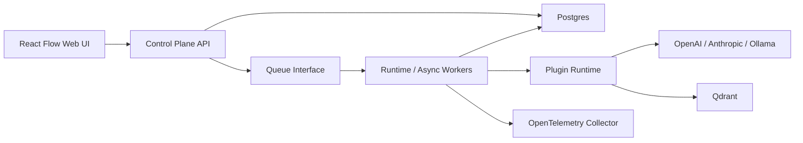

# Initial Architecture

## Repository inspection

The repository was empty except for `.git`, with no existing package manager, framework, database schema, auth model, deployment assets, or application structure. The platform therefore starts as a TypeScript/Node monorepo.

## Assumptions

- TypeScript/Node is used for the control plane, runtime worker, plugin SDK, provider SDK, and web UI.
- Postgres stores metadata, audit records, executions, usage, config values, and encrypted secret payloads.
- Redis/BullMQ is the default async queue, hidden behind a queue interface so NATS JetStream or Temporal can replace it.
- Qdrant is the default vector database adapter, hidden behind vector store plugin interfaces.
- React + React Flow is used for the visual builder.
- The dev auth provider is intentionally simple and must be replaced or federated for production.
- Envelope encryption is represented by a `KeyEncryptionKeyProvider` abstraction; local development uses an environment-provided key.
- LangChain/LangGraph are not used in the initial runtime core. They can be embedded inside plugins later without contaminating persisted pipeline specs.

## Service boundaries

### Control Plane API

Owns tenants, users, roles, environments, pipelines, versions, deployments, plugin/provider registries, config definitions and values, secrets metadata, audit logs, execution history, usage, rate limits, and evaluations.

### Runtime Worker

Loads an immutable pipeline version, resolves config and secrets, enforces tenant policy, executes the DAG, records execution/node history, emits telemetry, and records usage/cost.

### Async Worker

Executes ingestion, re-indexing, evaluation, batch runs, tenant vector deletion, model catalog refresh, and plugin health checks through a queue abstraction.

### Web UI

Visual builder and administrative screens. It edits pipeline drafts and control-plane resources only; runtime execution is delegated to the API/runtime.

## Core architecture

## Configuration model

Resolution precedence is:

1. runtime invocation override
2. tenant-pipeline override
3. tenant override
4. pipeline-version override
5. pipeline override
6. environment override
7. global default

Every resolved key includes the final value, source scope, source object id, default status, lock status, sensitivity, secret redaction state, and override policy explanation. Config definitions declare allowed scopes, validation, tenant/runtime override policy, nullability, and whether the key is sensitive or secret.

## Secret model

Pipeline specs never contain raw secrets. They reference logical keys such as `${secret.llm.api_key}`. Secret providers resolve references at runtime. The first functional provider is encrypted Postgres storage; future providers include environment variables, Kubernetes Secrets, Vault, and AWS Secrets Manager.

## Pipeline model

Pipeline definitions are versioned JSON/YAML documents with `apiVersion`, `kind`, `metadata`, and `spec`. Nodes reference plugin category/id/version, not hard-coded business logic. Published versions are immutable and deployments pin a specific version per environment and optionally per tenant.

## Multi-tenancy

All execution contexts include tenant id, pipeline id, pipeline version id, environment, actor, resolved config, secret resolver, telemetry handles, and cancellation/deadline controls. Tenant isolation is enforced in API middleware, config resolution, secret lookup, vector collection naming, execution records, audit logs, usage accounting, and provider credential selection.

## Vector isolation

Default policy is `collection_per_tenant_pipeline` with deterministic sanitized names:

`rag_{environment}_{tenant_slug}_{pipeline_slug}_{embedding_profile_hash}`

Embedding profile includes provider, model, dimensions, normalization, distance metric, and chunking settings hash. Profile changes require reindex or a separate collection.

## Deployment

The platform is designed for Kubernetes with separate web, API, runtime worker, async worker, Qdrant, Redis, Postgres, and OpenTelemetry collector components. Local development uses Docker Compose.

## Major dependencies

- Fastify: API framework.
- React + React Flow: visual graph editor.
- Zod: runtime schemas.
- OpenAI SDK, Anthropic SDK: SaaS model providers.
- Qdrant JS client: vector store adapter.
- OpenTelemetry API: traces and metrics.
- BullMQ + Redis: async jobs.

Dependency choices are OSS-friendly and isolated behind interfaces where practical.
